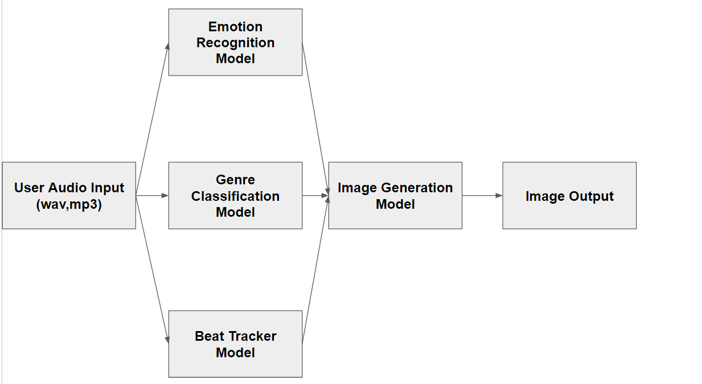

# 1. Project Scope
## 1.1. Category 
- This project falls under track 2 (Inspiring creativity with generativeAI)  of the Tiktok Tech Jam 2024 competition.
## 1.2. Problem statement
- With recent advancements in generative AI in the field of music, we see a surge of models that are capable of generating music from text prompts, commands and even short audio snippets from producers in hope of providing users with more inspiration about how they can improve their own music.
- This project aims to look into another avenue in which generative AI can provide producers with inspiration, specifically from imagery. 
- The end goal of this project **is to allow producers to insert their own music audio into the application and the application returns these users an image based off traits that are extracted from the audio snippet. Traits such as emotion, tempo, genre** etc.
## 1.3. Overall Workflow

- The user simply inputs their audio file into the web application and the application returns them text descriptions of the audio file (emotion, tempo and genre). The text description is then fed into the image generation model to generate an image.

## 1.4. Video Demonstration

# 2. Datasets
## 2.1. GTZAN dataset
- This dataset consists of 4 folders, genre_original,image_original, features_30_sec and features_3_sec. For the purposes of this project I used only the audio snippets from the genre_original folder.
- The [link](https://www.kaggle.com/datasets/andradaolteanu/gtzan-dataset-music-genre-classification) is provided.
## 2.2. EmotifyMusic
- This dataset consists of 400 audio files from each genre as well as a csv file that describes the emotions evoked by each audio snippet. The emotions were curated from various users. 
- The [link](https://www2.projects.science.uu.nl/memotion/emotifydata/) is provided.
## 2.3. Self-Labelled Dataset

# 3. Models
## 3.1. Genre Classifier Model
- This model uses the GTZAN dataset. 
- The pipeline for feature extraction includes splitting the audio into 5 equally lengthed segments and generating MFCCs from each segment with parameters, n_mfccs = 13, n_fft = 2048, hop_length = 512.
```
CNN = keras.Sequential()
CNN.add(keras.layers.Conv2D(32, (3,3), activation="relu",input_shape=(X_train.shape[1],X_train.shape[2],1)))
CNN.add(keras.layers.MaxPooling2D((3,3), strides=(2,2),padding="same"))
CNN.add(keras.layers.Conv2D(64,(3,3),activation ="relu"))
CNN.add(keras.layers.MaxPooling2D((3,3), strides=(2,2),padding="same"))
CNN.add(keras.layers.Conv2D(128,(2,2),activation ="relu"))
CNN.add(keras.layers.Flatten())
CNN.add(keras.layers.Dense(64,activation="relu"))
CNN.add(keras.layers.Dropout(0.1))
CNN.add(keras.layers.Dense(10,activation="softmax"))
```
- The code heavily references the code from [link](https://github.com/musikalkemist/DeepLearningForAudioWithPython)
## 3.2. Emotion Recongition Model
- This model uses the Emotify Music Dataset.
- The pipeline for this model includes splitting each 1 mintue audio into 10 second snippets resulting in 6 segments. Next, log-spectrograms with n_fft = 2048, hop_length=512 is generated and fed into the model.
```

model = keras.Sequential()
model.add(keras.layers.Conv2D(64, (5, 5), strides=2, activation="relu", padding="valid",input_shape = (X_train.shape[1],X_train.shape[2],1)))
model.add(keras.layers.BatchNormalization())

# 2nd Layer
model.add(keras.layers.Conv2D(64, (3, 3), strides=1, activation="relu", padding="same"))
model.add(keras.layers.BatchNormalization())

# 3rd Layer
model.add(keras.layers.MaxPooling2D((2, 2)))
model.add(keras.layers.Dropout(0.3))

# 4th Layer
model.add(keras.layers.Conv2D(128, (3, 3), strides=1, activation="relu", padding="same"))
model.add(keras.layers.BatchNormalization())

# 5th Layer
model.add(keras.layers.Conv2D(128, (3, 3), strides=1, activation="relu", padding="same"))
model.add(keras.layers.BatchNormalization())

# 6th Layer
model.add(keras.layers.MaxPooling2D((2, 2)))
model.add(keras.layers.Dropout(0.3))

# 7th Layer
model.add(keras.layers.Conv2D(256, (3, 3), strides=1, activation="relu", padding="same"))
model.add(keras.layers.BatchNormalization())

# 8th Layer
model.add(keras.layers.Conv2D(256, (3, 3), strides=1, activation="relu", padding="same"))
model.add(keras.layers.BatchNormalization())

# 9th Layer
model.add(keras.layers.Conv2D(384, (3, 3), strides=1, activation="relu", padding="same"))
model.add(keras.layers.BatchNormalization())

# 10th Layer
model.add(keras.layers.Conv2D(512, (3, 3), strides=1, activation="relu", padding="same"))
model.add(keras.layers.BatchNormalization())

# 11th Layer
model.add(keras.layers.Conv2D(256, (3, 3), strides=1, activation="relu", padding="same"))
model.add(keras.layers.BatchNormalization())

# 12th layer Dense
model.add(keras.layers.Flatten())
model.add(keras.layers.Dense(9,activation="softmax"))
```
- The model heavily references the A2E base model from this [paper](https://arxiv.org/pdf/1907.03572).
## 3.3. Beat Tracker Model
- This model makes use of the python librosa package.
- Documentation can be found [here](https://librosa.org/doc/latest/generated/librosa.beat.beat_track.html#librosa.beat.beat_track)

## 3.4. Image Generation Model
- The image generation models makes use of the stable diffusio model sourced from the diffusers packge from hugging face.
- The model is fine-tuned using the LoRA methodology and the scripts used can be found [here](https://huggingface.co/docs/diffusers/en/training/lora).


